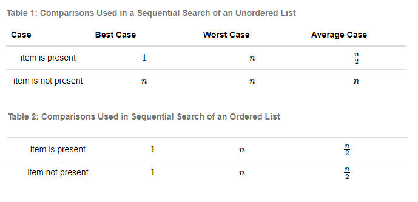
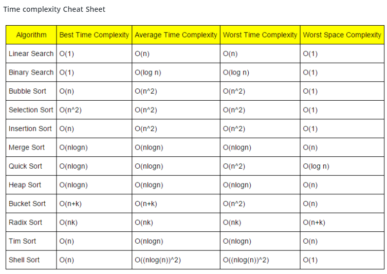

# Array Search and Sort

## Theory

> Sequential Search\
> 

> Time Complexity Cheat Sheet\
> 

## Example of partition

| 0   | 1   | 2   | 3   | 4   | 5   | 6   | 7   | 8   |
|-----|-----|-----|-----|-----|-----|-----|-----|-----|
|     |     |     |     |     |     |     |     |     |
| 63  | 65  | 35  | 5   | 30  | 10  | 47  | 75  | 4   |

#### pivot = 30

1. Start with pivot, low and high

| 0     | 1   | 2   | 3   | 4   | 5   | 6   | 7   | 8    |
|-------|-----|-----|-----|-----|-----|-----|-----|------|
| Pivot | Low |     |     |     |     |     |     | High |
| 30    | 65  | 35  | 5   | 63  | 10  | 47  | 75  | 4    |

2.

| 0     | 1   | 2   | 3   | 4   | 5   | 6   | 7   | 8    |
|-------|-----|-----|-----|-----|-----|-----|-----|------|
| Pivot | Low |     |     |     |     |     |     | High |
| 30    | 4   | 35  | 5   | 63  | 10  | 47  | 75  | 65   |

3.

| 0     | 1   | 2   | 3   | 4   | 5    | 6   | 7   | 8   |
|-------|-----|-----|-----|-----|------|-----|-----|-----|
| Pivot |     | Low |     |     | High |     |     |     |
| 30    | 4   | 10  | 5   | 63  | 35   | 47  | 75  | 65  |

4.

| 0     | 1   | 2   | 3    | 4   | 5   | 6   | 7   | 8   |
|-------|-----|-----|------|-----|-----|-----|-----|-----|
| Pivot |     |     | High | Low |     |     |     |     |
| 30    | 4   | 10  | 5    | 63  | 35  | 47  | 75  | 65  |

4.

| 0   | 1   | 2   | 3   | 4   | 5   | 6   | 7   | 8   |
|-----|-----|-----|-----|-----|-----|-----|-----|-----|
|     |     |     |     |     |     |     |     |     |
| 5   | 4   | 10  | 30  | 63  | 35  | 47  | 75  | 65  |