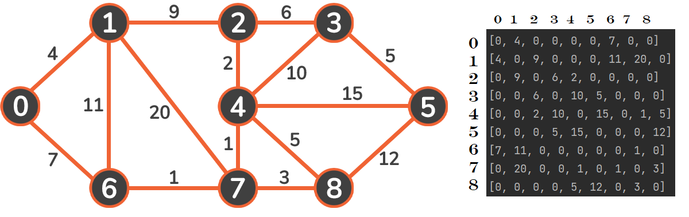
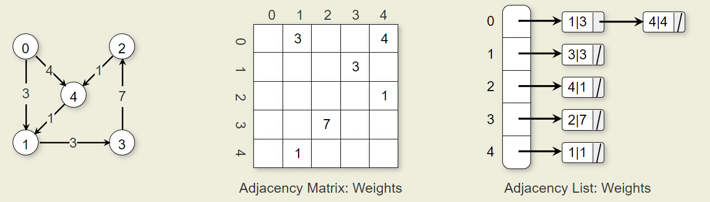

# shortest path

## Theory

> **shortest path**\
> d(A, D) = 10 (**A**-->**C**-->**B**-->**D**)\
> d(E, B) = inf

> **weight of edge**\
> w(A, D) = 20
> w(A, B) = 10

> **shortest path from S to X**\
> d(S, X) = min( d(S, U) + w(U, X) )

## Graph translation

## Calculations with bytes

A - No. of bytes vertices index
B - No. of bytes pointer
C - No. of bytes weight

Adjacency matrix = A * |vertices^2|
Link node = A + B + C
Adjacency list = B * |vertices| + Link node * |edges|

## Time complexity

Dijkstra: O(|Num of Edges|+|Num of vertices|*log|Num of vertices|)

## Documentation

- [Graphs in Python: Theory and implementation](https://stackabuse.com/courses/graphs-in-python-theory-and-implementation/lessons/dijkstras-algorithm/).